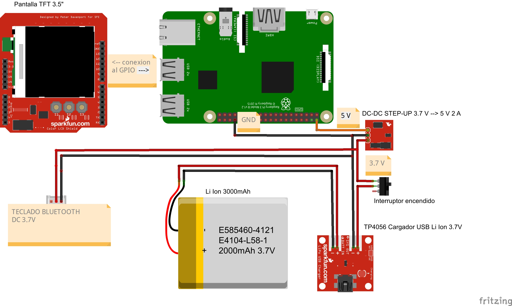
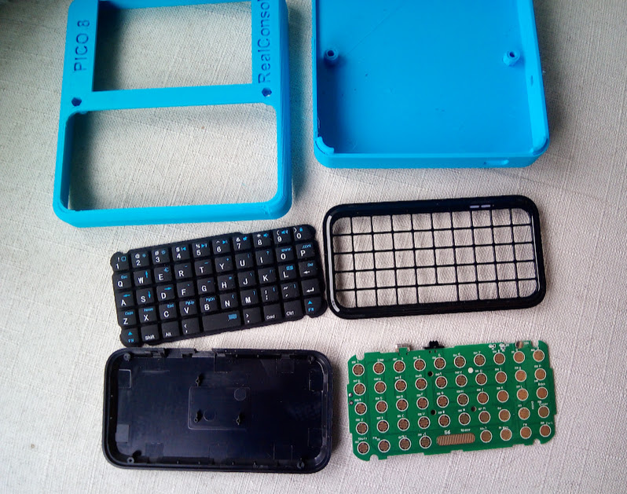
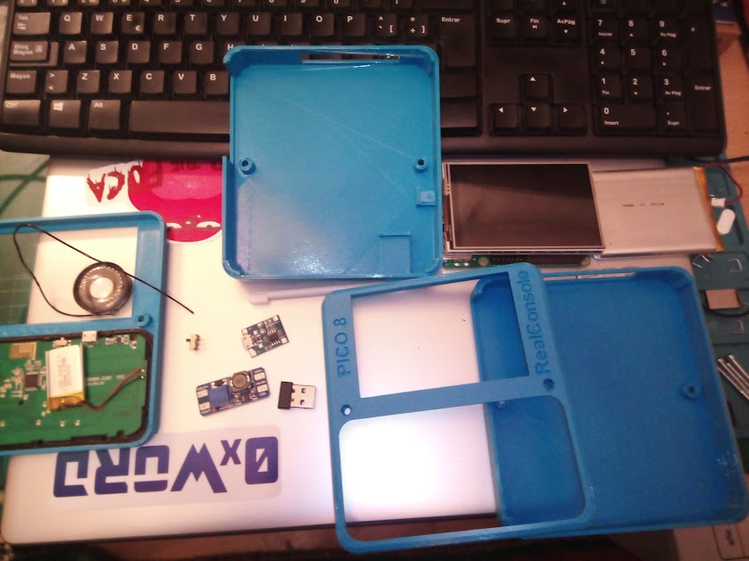
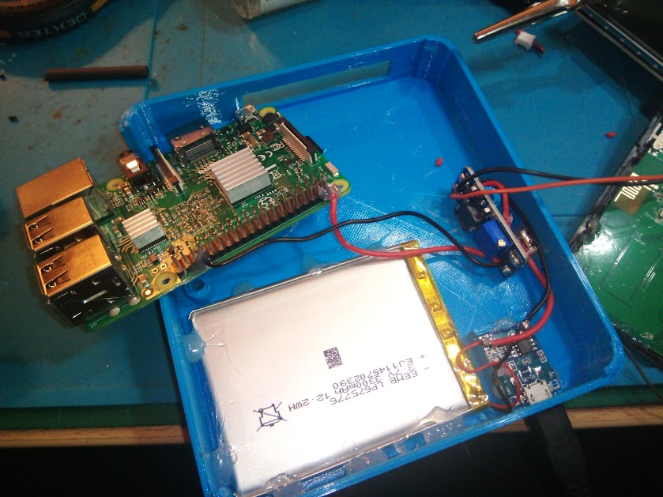
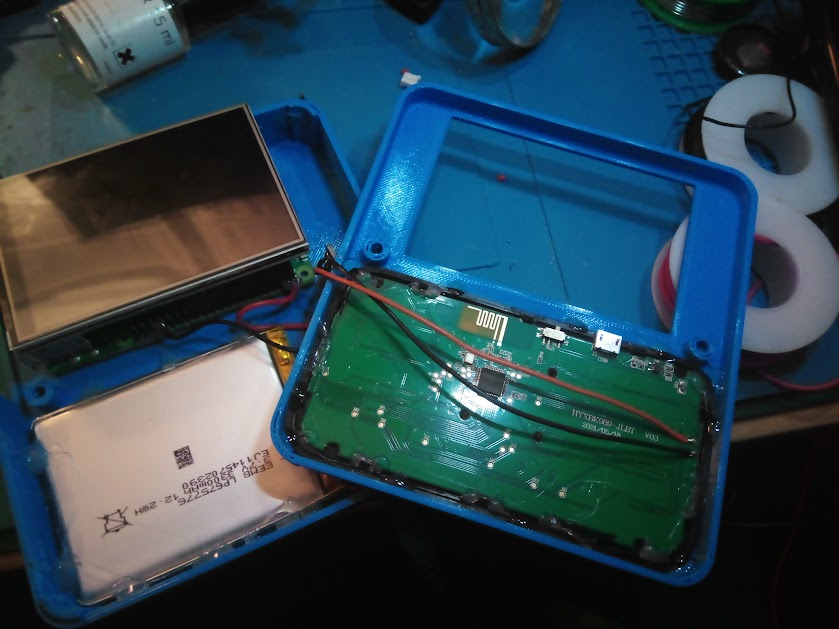
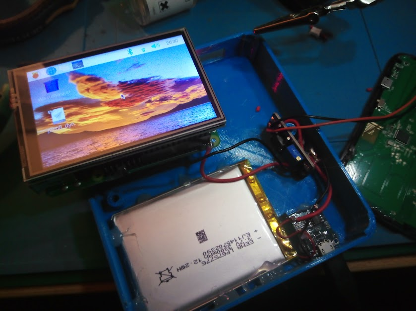
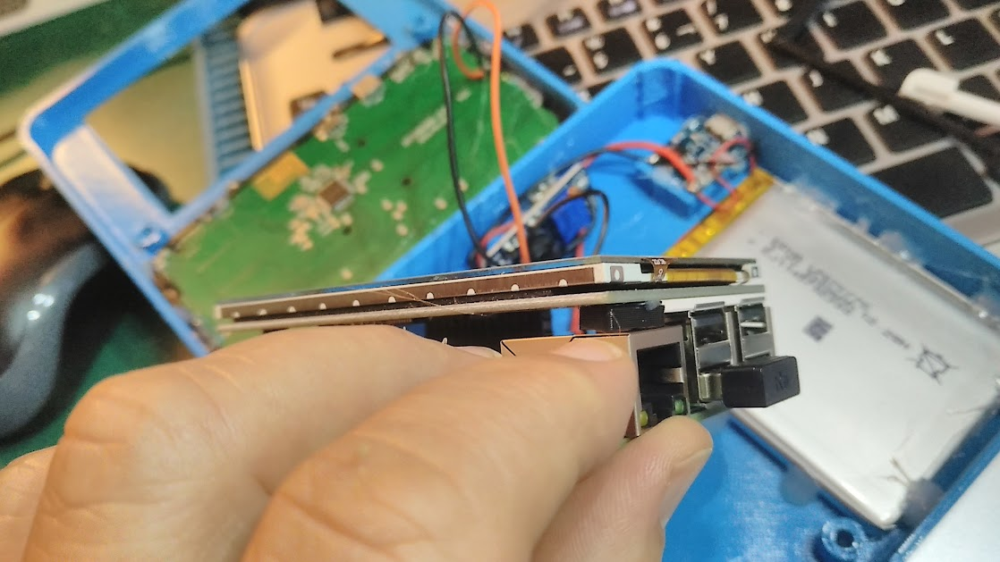
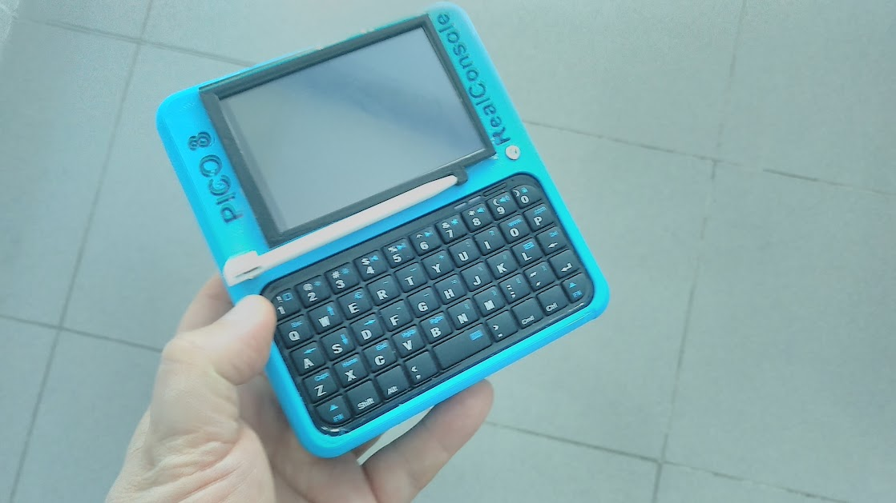

# Montaje del Cyberdeck-PICO8

## Esquema del dispositivo:

(Realizado con Fritzing)

**OJO. Algunos componentes no son del mismo aspecto que los reales, debido a que no están en la biblioteca de objetos de Fritzing. He elegido componentes de aspecto y funcion similar.**

## Proceso de montaje:

1 Despiece con dos piezas de la carcasa y teclado BT desmontado.

2 Despiece con piezas de la carcasa y piezas electronicas.

3 Montaje de la batería, TP4056 (cargador USB de batería) y switch de encendido. Ambos se fijan en dos cajetines que quedan alineados con los agujeros pasantes con cola termofusible. OJO: EL TP4056 se calienta mucho en la carga de la bateria y derrite momentaneamente la cola. Puedes atornillar a la base como alternativa.

4 Montaje del conversor DCDC Step-Up que sube de 3.7 a 5V y su conexión al GPIO del Raspberry Pi 3. Las conexiones se aseguran con una gota de cola termofusible, al igual que el resto de componentes al montar.

5 Montaje del teclado BT. Su interruptor de encendido se deja activado, se quita su batería de solo 150mAh y se conecta a la batería principal de 3300mAh. Su conexión se tira a la entrada del conversor dcdc (donde sigue habiendo 3.7V pero detras del switch de encendido, para que encienda a la vez que el Raspberry).

6 Prueba de encendido.

7 Montaje de tope en pantalla para que apoye sobre toma Ethernet del Raspberry y asi queden nivelados.

8 Terminado !! Se ha añadido una pieza en color negro que cubre el bisel de la pantalla, tiene un inserto para que el stick no se mueva. En el otro extremo el stick lleva pegado un imán que sse fija a uno de los tornillos pasantes. Los textos están en bajorelieve y se han resaltado con un marcador permanente.

