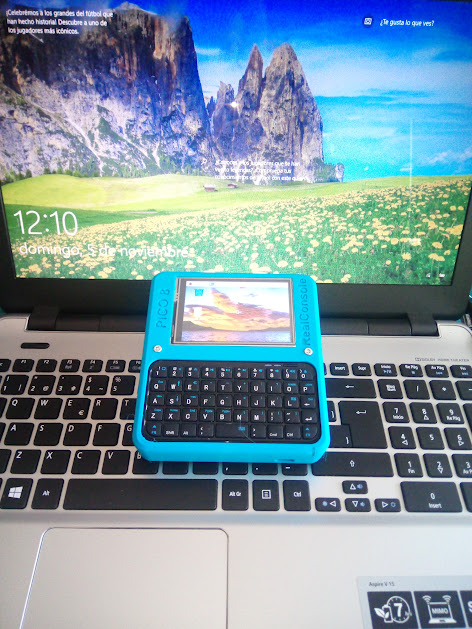
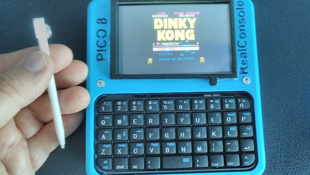

# Cyberdeck-PICO8

## Un Cyberdeck con Linux y PICO8

**Cyberdeck-PICO8** es un pequeño ordenador basado en Raspberry Pi 3 con el S.O. Raspbian y varios programas, entre ellos el emulador de juegos **PICO8**.

En 2020 creé otro miniordenador, quedo bien pero tuve algún error en el diseño, antes que rehacerlo he decidido hacer uno nuevo desde cero, el que ves aqui en este proyecto. 

## ¿ Qué es PICO8 ?

Es una consola de juegos de fantasía (así se le llama en la comunidad). Nunca ha existido en el mercado. Fue creada por **Lexaloffle Games** (aka Joseph White) y tiene un concepto muy minimalista, con solo 128x128 pixels y 16 colores. Es tambien un motor de juegos completamente integrado con editor de sprites, fondos y tiles, sonido, etc. Se puede pasar del juego al código mediante la tecla Esc, corregir cualquier cosa e inmediatamente volver a utilizarlo de forma instantanea. Se programa en **LUA**.

EL IDE es superliviano y los ficheros creados tambien, tanto es así que se salvan encapsulados dentro de un fichero png.al que se llama **cartridge** , imitando a los antiguos juegos retro. La encriptación se consigue mediante una técnica llamada **Esteganografía**. Este fichero contiene la imagen portada y lleva el codigo del programa.

Entre otras motivaciones para el desarrollo de PICO8 están las de centrarse en la programación y algoritmos dejando de lado las florituras. Personalmente me parece un enfoque superinteresante y es por eso que sigo este proyecto desde hace años.

Por eso mismo siempre he tenido ganas de crear un miniordenador que lo incluyera, para hacer miniaplicaciones sencillas en cualquier lugar. Ha habido varios intentos para hacer una "real". 

Esta es mi propia aportación, la quiero para un uso frecuente para lectura de documentos, navegación, programación y claro, también para jugar.

Por todo lo anterior he incluido en el diseño de la carcasa el nombre grabado **PICO8 Real Concole**.

Para saber mas de PICO8 mira [**aquí**](https://www.lexaloffle.com/pico-8.php).

## Características principales:

- Chasis de dos piezas en PLA que se unen mediante dos tornillos de M3x25.
- Raspberry Pi3 mas pantalla de 3,5" que tiene el mismo tamaño y se acopla encima. La pantalla es resistiva y lleva un stick adosado mediante un imán.
- Batería Ion Litio de 3300mAh.
- Cargador USB de batería basado en TP4056.
- Conversor DCDC Step-Up que subre los 3.7 a 5V, para que el sistema funcione correctamente. 
- Teclado Bluetooth de tamaño muy reducido.
- Botón lateral de encendido. Apagado por software.

## Contenido de las carpetas:

[**Montaje** ](Montaje/README.md) 

Proceso de montaje mediante fotos comentadas.

[**STLs** ](STL/README.md) 

Ficheros STL listos para imprimir.

## Lista de componentes (BOM)

[BOM.xls](BOM.xlsx)

## Autor

Me llamo **Victor Barahona** y soy un ingeniero que ha sabido adaptarse a diferentes olas tecnológicas a lo largo de 30 años de carrera profesional. Tanto en el sector público como privado, tanto por cuenta ajena como de autónomo y emprendedor.

He trabajado en enseñanza, industria de automoción, telefonía móvil, impresión 3D, desarrollo de proyectos opensource y actualmente estoy en la empresa **I+Med** donde investigo en sistemas embebidos y Bioelectrónica.

Tengo varios hobbies, entre ellos la Permacultura. Soy también un maker entusiasta y construyo cosas como impresoras 3D o ARSandbox.

[**Mi cuenta Github**](https://github.com/Egokitek)

[Sitio web **www.victorbarahona.com**](http://www.victorbarahona.com)

## Créditos

Hace tiempo que quería hacer un dispositivo asi y he visto muchos diseños que me han inspirado. Principalmente los siguientes:

[**YARH.IO** Micro 2](https://yarh.io/yarh-io-m2.html)

[**Decktility**](https://github.com/ByteWelder/Decktility)

[**UConsole** ClockworkPi](https://www.clockworkpi.com/uconsole)

No obstante solo se parecen por fuera, por dentro mi diseño tiene bastantes diferencias y es en general mas simple.

## Licencia

**GPL3.0**

## Posibles mejoras

- Añadir altavox conectado internamente al jack de audio/video compuesto.
- Monitorear tension de batería y mostrarla mediante un indicador.
- Añadir un Asa que permita transportarlo mejor y que sirva de peana para apoyar inclinado en una superficie plana.
- ...

